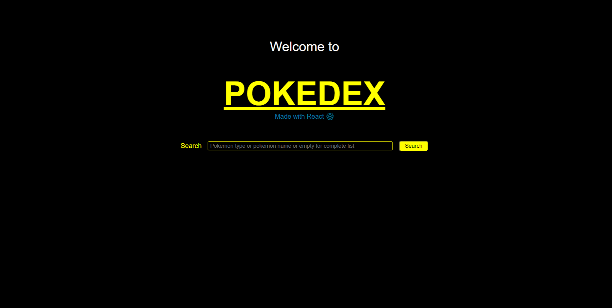
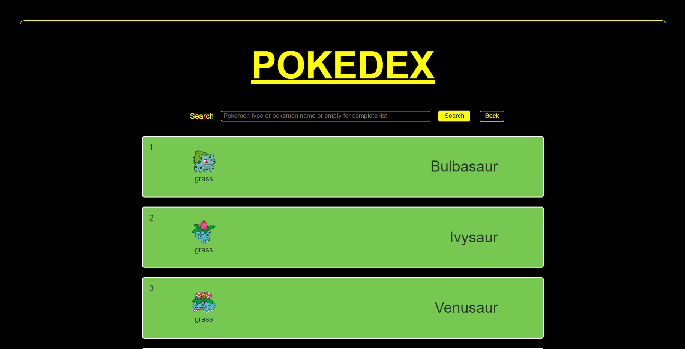
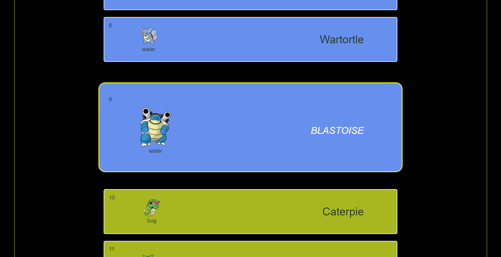
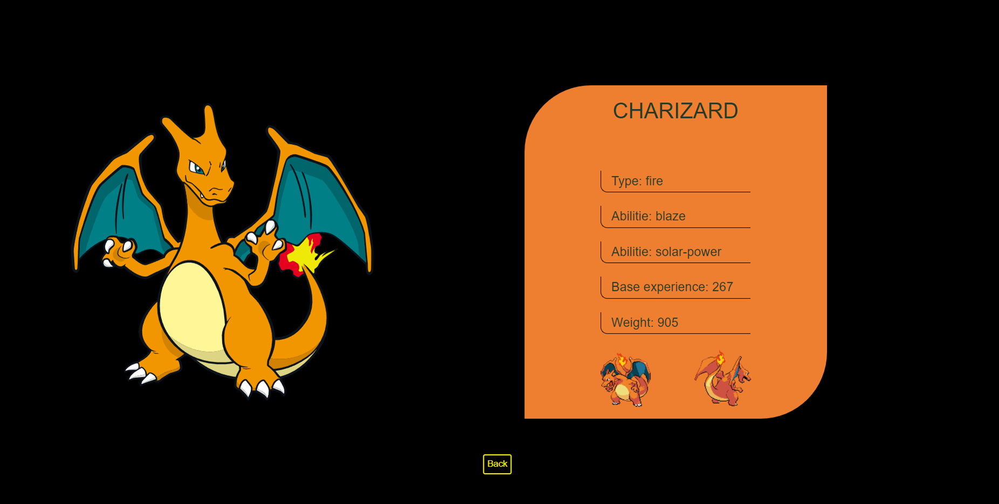

# POKEDEX

Projeto pessoal de um Pokedex. O projeto contem três páginas, a página inicial de boas vindas, a página de listagem dos pokemons e a página de detalhes de um pokemon específico.

Nas páginas de boas vindas e de listagem dos pokemons, é  possível realizar uma busca pelo nome e pelo tipo do pokemon ou deixar a busca vazia para carregar todos os pokemons da api. Caso seja digitado um nome inválido ou apresente alguma falha no carregamento dos pokemons, uma mensagem de erro é exibida e solitado para realizar nova busca. 

## Tecnologias utilizada para criação do projeto

## Telas do Pokedex

Figura1: Página inicial.

Figura2: Página de listagem dos pokemons.

Figura3: Card do pokemon em destaque.

Figura4: Página de detalhes do pokemon selecionado.

>*Projeto desenvolvido em fevereiro/2024*